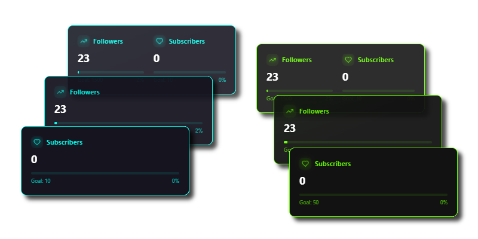

# CloutCatcher  

This project allows you to connect a React app with Twitch to get real-time updates on followers and subscribers. It uses Twitch's OAuth system for secure authentication and WebSockets to receive live notifications.

---



---

## Features  

- **Live Updates**: Get instant notifications when someone follows or subscribes to your Twitch channel.  
- **Secure Authentication**: Uses Twitch’s OAuth system to log in safely.  
- **Automatic Reconnection**: If the connection drops, it will reconnect on its own.  
- **Easy Setup**: Just enter your Twitch credentials, and you're good to go!  

## Installation  

First, make sure you have Node.js installed on your computer. Then:  

```sh
# Clone the project
git clone https://github.com/maseurodrigo/CloutCatcher.git

# Move into the project folder
cd CloutCatcher

# Install required files
npm install
```

## How to Use  

### Get Your Twitch API Credentials  

Before using this, you'll need three things from [Twitch Developer Portal](https://dev.twitch.tv/console):  

- **Client ID**  
- **Client Secret**  
- **Redirect URI**  

## Setting Up Environment Variables  

Store your Twitch credentials safely in a `.env` file:  

```sh
VITE_TWITCH_CLIENT_ID=your_client_id
VITE_TWITCH_CLIENT_SECRET=your_client_secret
VITE_TWITCH_REDIRECT_URI=your_redirect_uri
```

## How It Works  

1. If the app doesn’t have an access token, it redirects users to log in via Twitch.  
2. Once logged in, it connects to Twitch's WebSocket to listen for updates.  
3. If the connection drops, it automatically tries to reconnect.  
4. The app updates in real-time when someone follows or subscribes.  
